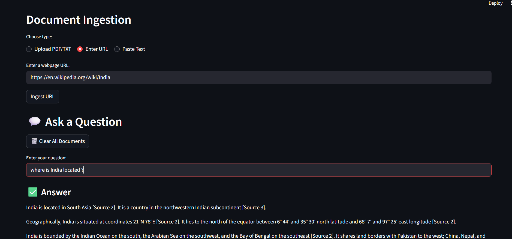

# 📚 Documentation Support Agent

A Retrieval-Augmented Generation (RAG) system for document-based Q&A.

[](https://www.python.org/downloads/)
[](https://streamlit.io/) .

---

## 🎯 Project Overview

This system enables users to upload documents (PDF, TXT, URLs, or raw text) and ask questions with guaranteed source-based answers. The agent **refuses to hallucinate** - if information isn't in the provided documents, it clearly states so.

**Built for:** Documentation Support Agent Technical Assessment

---

## 🖥️ User Interface Preview

<p align="center">
  
</p>

---

## ✨ Key Features

- ✅ **Multi-source ingestion**: PDF, TXT files, web URLs, and raw text
- ✅ **Semantic chunking**: Uses LangChain's SemanticChunker for intelligent text splitting
- ✅ **Pure semantic search**: sentence-transformers embeddings + FAISS vector store
- ✅ **Cosine similarity**: Normalized vectors for meaning-based retrieval
- ✅ **Zero hallucination**: Multi-layer guardrails prevent made-up answers
- ✅ **Source highlighting**: Shows exact passages with similarity scores
- ✅ **Web interface**: Clean Streamlit UI with document management

---

## 🏗️ Architecture

```
User Query
    ↓
[Embedding Model] → all-MiniLM-L6-v2 (384-dim vectors)
    ↓
[FAISS Search] → Cosine similarity (IndexFlatIP)
    ↓
[Top-5 Chunks] → Most relevant passages retrieved
    ↓
[Gemini LLM] → Answer generation (temp=0.1, strict prompt)
    ↓
[Response] → Answer + source citations + similarity scores
```

### Core Components

**DocumentProcessor**
- Extracts text from PDFs, TXT files, URLs
- Uses LangChain SemanticChunker for context-aware splitting
- Preserves semantic coherence across chunks

**VectorStore**
- sentence-transformers for embeddings
- FAISS IndexFlatIP for fast cosine similarity search
- Normalized vectors for semantic (not magnitude) comparison

**AnswerGenerator**
- Gemini 2.5 Flash with strict source-only prompting
- Temperature: 0.1 (low creativity = high factuality)
- Mandatory source citations in responses

**ChatBot**
- Orchestrates the full RAG pipeline
- Manages document lifecycle (ingest/clear)
- Coordinates retrieval and generation

---

## 🚀 Quick Start

### Prerequisites
- Python 3.8 or higher
- Gemini API key ([Get free key](https://ai.google.dev/))

### Installation

1. **Install dependencies**
```bash
pip install -r requirements.txt
```

2. **Run the application**
```bash
streamlit run doc_support_agent.py
```

3. **Access the interface**
- Opens automatically at `http://localhost:8501`
- Enter your Gemini API key when prompted

---

## 📖 Usage

### Step 1: Initialize
Enter your Gemini API key in the text field. Wait for "✅ Chatbot initialized successfully!"

### Step 2: Upload Documents
Choose from three options:
- **Upload PDF/TXT**: Select local files
- **Enter URL**: Paste webpage URLs for scraping
- **Paste Text**: Directly input text content

Multiple documents can be added sequentially.

### Step 3: Ask Questions
Type your question in the text field. The system will:
1. Search for relevant chunks (semantic search)
2. Generate answer using only those sources
3. Display answer with source citations
4. Show source excerpts with similarity scores

### Step 4: Clear Documents (Optional)
Click "🗑️ Clear All Documents" to remove all ingested data and start fresh.

---

## 🛡️ Hallucination Prevention Strategy

### Three-Layer Defense

**Layer 1: Strict Prompting**
```
"Answer ONLY using information from the sources below"
"DO NOT use any external knowledge"
"If sources don't contain enough info, say so clearly"
```

**Layer 2: Low Temperature (0.1)**
- Minimizes LLM creativity and randomness
- Ensures deterministic, grounded responses
- Reduces likelihood of invented information

**Layer 3: Mandatory Citations**
- LLM must reference [Source 1], [Source 2], etc.
- Makes grounding transparent and verifiable
- Easy to trace answers back to documents

**Layer 4: Semantic Filtering**
- Only retrieves chunks above relevance threshold
- Top-k retrieval (default: 5 chunks)
- Prevents irrelevant context from confusing LLM

---

## 🔬 Technical Deep Dive

### Why Semantic Chunking?

Traditional fixed-size chunking (e.g., 1000 characters) often breaks mid-sentence or mid-thought. **LangChain's SemanticChunker** splits text based on semantic coherence:

```python
# Traditional chunking problems:
"...Python supports OOP. |CHUNK BREAK| Python has simple syntax..."
# Context lost! Each chunk lacks full meaning.

# Semantic chunking preserves context:
"...Python supports OOP. Python has simple syntax..." 
# Complete thoughts stay together.
```

### Why Normalize Vectors?

```python
# Without normalization (Euclidean distance)
v1 = [0.5, 0.5]   # Short vector
v2 = [5.0, 5.0]   # Long vector, SAME direction
distance = 6.36   # Seems very different!

# With normalization (Cosine similarity)
faiss.normalize_L2(embeddings)
v1_norm = [0.707, 0.707]
v2_norm = [0.707, 0.707]
similarity = 1.0  # Correctly identifies as similar!
```

**Key insight:** For text, we care about semantic **direction** (meaning), not vector **magnitude** (arbitrary scale). Normalization + IndexFlatIP gives us pure cosine similarity.

### Retrieval Pipeline

1. **Query encoding**: Convert question to 384-dim embedding
2. **Normalization**: L2-normalize query vector
3. **FAISS search**: IndexFlatIP computes dot products (= cosine similarity for normalized vectors)
4. **Top-k selection**: Return 5 most similar chunks
5. **Context building**: Combine chunks for LLM

---
## 🔧 Configuration Options

### Chunking (in DocumentProcessor)
```python
# Automatic semantic-based chunking
# No manual chunk_size or overlap needed
# LangChain determines optimal boundaries
```

### Retrieval (in VectorStore.search)
```python
k = 5  # Number of chunks to retrieve
# Adjustable: chatbot.query(question, k=10)
```

### LLM Generation (in AnswerGenerator)
```python
generation_config = {
    "temperature": 0.1,        # Low = factual, high = creative
    "top_p": 0.9,             # Nucleus sampling
    "max_output_tokens": 1500  # Response length limit
}
```

---

## 🎓 Technical Decisions & Trade-offs

### Why sentence-transformers/all-MiniLM-L6-v2?
- **Speed**: Fast inference, only 384 dimensions
- **Quality**: Good semantic understanding for general text
- **Size**: 80MB model (reasonable download)

**Alternative:** all-mpnet-base-v2 (768-dim, better quality, slower)

### Why FAISS?
- **Performance**: Millisecond search even with 100k+ vectors
- **Memory efficient**: Optimized C++ implementation
- **Scalable**: Supports billions of vectors
- **Industry standard**: Developed by Meta AI

**Alternative:** Pinecone, Weaviate (managed services, more features)

### Why Gemini 2.5 Flash?
- **Speed**: Fast response times 
- **Quality**: Good instruction following
- **Cost**: Free tier available
- **Reliability**: Handles strict prompting well

**Alternative:** GPT-4, Claude (better quality, higher cost) or Transformer - based Open Source Models such as LiquidAI/LFM2-1.2B-RAG

### Why LangChain SemanticChunker?
- **Context preservation**: Doesn't split mid-thought
- **Semantic coherence**: Uses embeddings to find boundaries
- **Better retrieval**: More meaningful chunks = better matches

**Alternative:** Fixed-size chunking (simpler, less accurate)

---

## 📦 Project Structure

```
.
├── doc_support_agent.py                 # Main Streamlit application
├── requirements.txt       # Python dependencies
├── README.md             # This file
└── .gitignore            # Git exclusions (API keys, etc.)
```

### Class Hierarchy

```
ChatBot
  ├── DocumentProcessor (ingestion + chunking)
  ├── VectorStore (embeddings + search)
  ├── AnswerGenerator (LLM interface)
  └── Similar_source (formatting utilities)
```

---

## 🚨 Known Limitations

1. **In-memory storage**: Documents cleared on app restart
   - *Production fix*: Use persistent vector DB (Pinecone, Weaviate)

2. **No conversation history**: Each query is independent
   - *Production fix*: Implement chat memory with context window

3. **English-optimized**: Model trained primarily on English
   - *Production fix*: Use multilingual models (paraphrase-multilingual)

4. **PDF quality dependent**: Scanned PDFs won't extract text
   - *Production fix*: Add OCR (pytesseract, AWS Textract)

5. **Single-session**: No user accounts or saved documents
   - *Production fix*: Add authentication and database storage

---

## 🔮 Future Enhancements

- [ ] **Re-ranking stage**: Add cross-encoder for better precision
- [ ] **Conversation memory**: Track dialogue context
- [ ] **Document versioning**: Update docs without full re-index
- [ ] **Batch upload**: Process multiple files simultaneously
- [ ] **Query caching**: Store common question-answer pairs
- [ ] **Advanced filters**: Filter by document source, date, etc.
- [ ] **Export functionality**: Save Q&A pairs as markdown/PDF
- [ ] **Analytics**: Track popular queries, retrieval quality

---

## 🧪 Testing Recommendations

### Test Cases

1. **Clear Answer Test**
   - Upload Python tutorial
   - Ask: "What is a list comprehension?"
   - ✅ Should get detailed answer with sources

2. **Hallucination Prevention Test**
   - Same document
   - Ask: "How do I use React hooks?"
   - ✅ Should refuse (not in Python docs)

3. **Multi-source Test**
   - Upload multiple documents
   - Ask question spanning both
   - ✅ Should synthesize from multiple sources

4. **Edge Cases**
   - Empty query → validation error
   - No documents uploaded → warning message
   - Malformed PDF → graceful error handling

---

### ✅ File/URL/Text Ingestion
- [x] PDF files (PyPDF2)
- [x] TXT files (native Python)
- [x] URLs (BeautifulSoup + requests)
- [x] Raw text (direct input)
- [x] Intelligent chunking (SemanticChunker)

### ✅ Embedding and Retrieval
- [x] HuggingFace model (sentence-transformers)
- [x] Vector database (FAISS in-memory)
- [x] Semantic search (cosine similarity)
- [x] **No keyword matching** (pure embeddings)

### ✅ Chatbot Interface
- [x] Question input
- [x] Strictly source-based answers
- [x] Source passage highlighting
- [x] Similarity scores displayed
- [x] Clean web UI (Streamlit)

### ✅ Hallucination Guardrails
- [x] Strict prompting
- [x] Low temperature (0.1)
- [x] Mandatory citations
- [x] Clear "insufficient information" responses
- [x] No invented content

### ✅ Code Quality
- [x] Modular structure (4 main classes)
- [x] Clear separation of concerns
- [x] Type hints (Pydantic models)
- [x] Error handling
- [x] Clean, readable code

---


## 🏆 What Makes This Solution Stand Out

1. **Modern RAG**: Uses current best practices (semantic chunking, normalized vectors)
2. **Zero to minimal hallucination**: Multiple layers of prevention
3. **Clean code**: Well-structured, typed, documented

---

## 📞 Support

For setup issues:
1. Check `requirements.txt` - all dependencies installed?
2. Python 3.8+ installed? Check with `python --version`
3. Valid Gemini API key from https://ai.google.dev/
4. First run downloads model (~80MB) - wait for completion

---

## 👤 Author

Documentation Support Agent - Siddhi Pandya

---

**Built with ❤️ for accurate, trustworthy document Q&A**